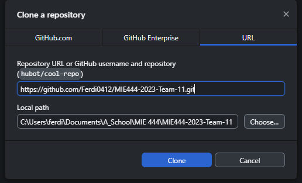

# MIE444-2023-Team-11
Team 11 repository for MIE444 project, 2023

# Using Git
 **[Aside] Breifly, what is Git?**
 Git is a version control tool that shows changes to the files contained inside *repositories*.
 When using Git you will (almost always) have:
- A **remote repository**. This is what your are looking at now on GitHub.com. You can think of this as the "official" version(s) of the repository.
- A **local repository**. This is what you will be working on on your local computer. You can think of this as your "personal" version, or "temporary" version(s).
In order to create your **local repository**, you should use a Git **clone**. I recommend using **GitHub Desktop** to do this, as it makes it easier.
 In order to update your **local repository** to match the **remote repository**, you should use a Git **pull**. This will update changes to the **remote repository** on you local computer, but it **WILL NOT** overwrite your local changes.
 In order to "store" or "save" your changes locally, you use a Git **commit**. This **WILL NOT** update the **remote repository**. It is good practice to apply appropriate messages to keep track and overview over changes.
  In order to update the **remote repository**, you use a Git **push**. This will send all the **commit**s from your local computer to the **remote repository**.

## GitHub Desktop
I recommend downloading the github Desktop App, this will make it easier to get started with Git and GitHub. You can download it from [GitHub Desktop](https://desktop.github.com/). Ensure that it is downloaded, and set up with your GitHub account before proceeding.

### Cloning
In order to clone this repository, ...
 For this repository, the URL is "[https://github.com/Ferdi0412/MIE444-2023-Team-11.git](https://github.com/Ferdi0412/MIE444-2023-Team-11.git)".
- In the GitHub Desktop app, press down ***File*** on the header bar, and press "Clone repository...".
- In the popup that appears, titled "Clone a repository", go to the "URL" tab.
- Insert the repository URL under the "Repository URL or GitHub username and repository (hubot/cool-repo)"
- Apply where in your computer to store the **local repository** under "Local path"
-   [NOTE]: Having some issues getting and image in...
 
